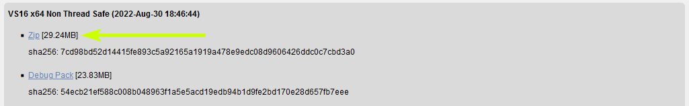
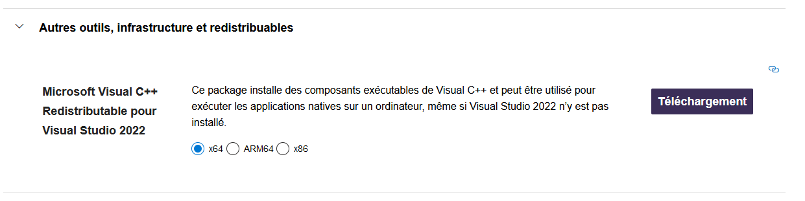

> <h1 align="center">Symfony sur Windows</h1>

> Pour commencer il vous faut PHP, si vous n'avez pas PHP ou alors si votre version de PHP est inférieure à PHP 8, suivez les étapes suivantes. Sinon allez [ici](#symfony-cli).

<h3>Sommaire</h3>

<details>
    <summary>Liens importants</summary>
    <ul>
        <li><a href="#php">PHP</a></li>
        <li><a href="#symfony-cli">Symfony CLI</a></li>
        <li><a href="#composer">Composer</a></li>
        <li><a href="#git">Git</a></li>
        <li><a href="#end">Finalement</a></li>
    </ul>
</details>

---

<h1 align="center"><a id="php">PHP</a></h1>

> Allez sur [php.net](https://php.net) et cliquez sur "Download"


> Puis choisissez "Windows downloads" et cliquez sur "Zip" 




> Une fois le téléchargement fini, faites un nouveau dossier nommé "php" à la racine de votre disque C et extrayez le contenu du fichier téléchargé dans le dossier.

---

<h1 align="center"><a id="symfony-cli">Symfony CLI</a></h1>

> Pour Symfony CLI il vous faut un outil nommé "Scoop", Scoop est un programme qui est utilisé dans l'Invite de Commande, il permet d'installer des application plus facilement. Nous allons l'utiliser pour installer Symfony CLI.
> 
> Si vous avez déjà Scoop, allez [ici](#composer)

> Pour installer Scoop, il va falloir ouvrir un PowerShell. Pour cela deux choix:
> 
> - Faites Win+R et tapez "powershell" et Enter
> 
> - Appuyez sur Win et tapez Powershell et ouvrez le.


> Allez ensuite sur [scoop.sh](https://scoop.sh/)
> 
> Récupérez les deux lignes qui vous sont proposez 

```powershell
Set-ExecutionPolicy RemoteSigned -Scope CurrentUser
irm get.scoop.sh | iex
```

> Collez les dans votre powershell et appuyez sur Enter (vous n'aurez pas de retours si tous c'est bien passé)
> 
> Vous pouvez ensuite fermer le powershell et ouvrir une Invite de commande
> 
> (Win+R et "cmd" ou Win et cherchez "cmd")
> 
> Et entrez cette commande

```shell
scoop install symfony-cli
```

---

<h1 align="center"><a id="composer">Composer</a></h1>

> Si vous n'avez pas composer suivez les prochaines étapes, sinon allez [ici](#git)

> Pour installer Composer, ce n'est pas compliqué, allez sur [get.composer.com](https://getcomposer.org/download/) et prenez l'exécutable.


> Une fois téléchargé, exécutez le et installer le.

> Si après avoir choisis PHP vous avez une erreur. Sinon continuez [ici](#no_phperror_composer).


> <a id="no_phperror_composer">
> Si vous n'avez pas d'erreur c'est ici
> </a>

---

<h1 align="center"><a id="git">Git</a></h1>

> Si vous avez déjà git et qu'un fichier ".gitconfig" est déjà présent dans votre dossier utilisateur allez [ici](#end)

> Pour installer git allez sur [git-scm.com](https://git-scm.com/downloads) choisissez Windows



> Choisissez en fonction de votre ordinateur

> Une fois téléchargé, exécutez le .exe et suivez l'installeur jusqu'au bout *vous pouvez juste cliquer "Next" jusqu'à la fin, les paramètres par défaut sont  suffisants*

> Une fois fait, faites ces commandes dans une invite de commande, en les adaptant à vos besoins.

```shell
git config --global user.name "Votre Nom"
git config --global user.email "Votre E-Mail"
```

---

<h1 align="center"><a id="end">Finalement</a></h1>

> Une fois avoir fini, il vous faut maintenant un dossier où stocker vos projets Symfony. Je vous conseil de faire un dossier dans Documents nommé "Symfony". Pour ouvrir une Invite de commande dans un dossier vous avez deux choix, dépendant de votre version de Windows.

Windows 10


Windows 11

> Faites clique droit sur le dossier "Symfony" et cliquez sur Ouvrir dans Windows Terminal


> Il ne vous reste plus qu'à initialiser votre projet

```shell
#Ceci est une commande d'example, vos besoins peuvent variés
symfony new nom_du_projet --webapp
```

> Pour lancer le projet

```shell
cd nom_du_projet
symfony serve
```
